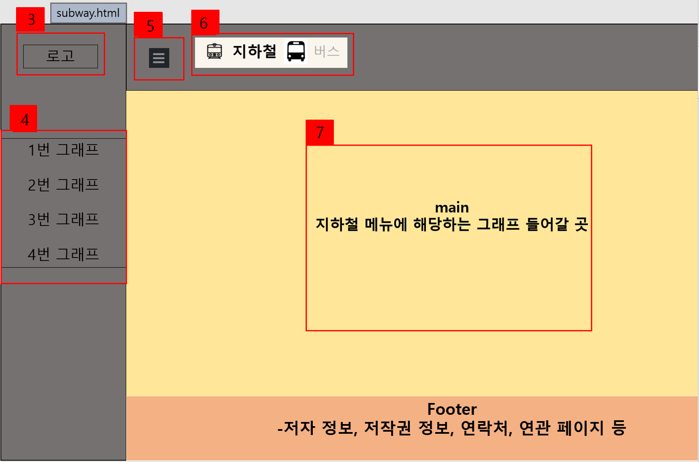

# (코시국에 어디를 가나요?)

- 코로나가 발생한 이후로 지하철과 버스 이용량이 어떻게 변화하였는지 데이터 분석 및 시각화를 통해 사용자에게 인사이트를 제공하는 사이트

## 프로젝트 구성 안내

1. 시작 페이지
   - 프로젝트 소개
2. 메인 페이지

- 지하철

  - 일별 지하철 이용자수 변화량
  - 고정유동인구
  - 확진자&승차량 연관성
  - 노선별 변화율
  - 역별 코로나 영향력
  - 요일별 시간대별 지하철 이용자 수

- 버스
  - 일별 버스 이용자수 변화량
  - 확진자&승차량 연관성
  - 코로나 전/후 버스 종류별 변화
  - 지역별 평균 이용량

## 1. 프로젝트 소개

- 프로젝트 개발 기간: 2021.11.09~2021.12.01(3주)
- 데이터: 서울특별시 코로나19 확진자 발생동향(서울열린데이터광장) : https://data.seoul.go.kr/dataList/OA-20461/S/1/datasetView.do  
  2008~2020 서울교통공사 연도별 일별 시간대별 역별 승하차 인원: https://data.seoul.go.kr/dataList/OA-12921/F/1/datasetView.do  
  서울시 지하철호 선별 역별 승하차 인원 정보: https://data.seoul.go.kr/dataList/OA-12914/S/1/datasetView.do#  
  2015~2020 서울시 버스노선별 정류장별 승하차 인원 정보: https://data.seoul.go.kr/dataList/OA-12912/S/1/datasetView.do#  
  2020 6월 ~ 2021년 10월 지역별, 시간대별 승차 버스 데이터(인스파일러) : https://insfiler.com/detail/rt_transit_day-0005?category=total  

- 기술 스택 (python, spark, pandas, jupyter, javascript, html, css, Tableau, AWS, flask 등)
  
- 사용된 라이브러리 (PySpark, numpy, matplotlib, datetime, holidays, animate 등)

## 2. 프로젝트 목표

코로나로 거리두기단계 격상이 되었는데, 대중교통(지하철, 버스)이용량의 변화는 실감할 수 없었다. 코로나 전후로 얼만큼 변화했을지 다양한 방면으로 분석을 하고, 얻을 수 있는 인사이트는 어떤 것이 있을지 알아볼려고 한다. 그리고 데이터 분석을 토대로 시각화하여 사용자에게 다양한 정보를 제공하려고 한다.

## 3. 프로젝트 구성도

  
  
  
  
  

## 4. 프로젝트 팀원 역할 분담

| 이름   | 담당 업무                 |
| ------ | ------------------------- |
| 이상우 | 팀장/프론트엔드 /백엔드   |
| 김태정 | 프론트엔드/발표           |
| 조도흔 | 데이터 분석/데이터 수집   |
| 안창혁 | 데이터 분석/데이터 수집   |
| 추　준 | 데이터 시각화/데이터 분석 |
| 남기윤 | 데이터 시각화/데이터 분석 |

**멤버별 responsibility**

1. 팀장

- 기획 단계: 구체적인 설계와 지표에 따른 프로젝트 제안서 작성
- 개발 단계: 팀원간의 일정 등 조율 + 프론트 개발
- 수정 단계: 기획, 스크럼 진행, 코치님 피드백 반영해서 수정, 개발 문서 작성 및 회의록 작성

2. 프론트엔드 & 백엔드

- 기획 단계: 큰 주제에서 문제 해결 아이디어 도출, 데이터 수집, 와이어프레임 작성
- 개발 단계: 와이어프레임을 기반으로 구현, UI 디자인 완성, 웹페이지에 필요한 서버 개발
- 수정 단계: 피드백 반영해서 백엔드 /프론트 디자인 수정

3.  데이터 분석

- 기획 단계: 기획 데이터 분석을 통해 해결하고자 하는 문제를 정의
- 개발 단계: 데이터 분석 개념 총동원하기 및 시각화에 필요한 데이터 전처리
- 수정 단계: 코치님 피드백 반영해서 분석/ 전처리 방법 수정

4.  데이터 시각화

- 기획 단계: 데이터 시각화 방법 강구
- 개발 단계: 전처리 된 데이터 이용하여 데이터 시각화 및 시각화 디자인
- 수정 단계: 코치님 피드백 반영해서 시각화 방식 수정

## 5. 버전

- Cosiguk v1.0.0

## 6. FAQ

- 자주 받는 질문 정리
